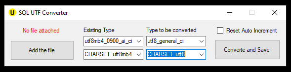

# MySQL-UTF-Converter-App
The UTF Converter App is a lightweight C# tool for developers and DB admins to convert character sets in MySQL databases. It addresses issues with importing database files into older phpMyAdmin versions, especially those related to UTF-8 encoding.

## Application Interface

  
 

## File Types can be converted

 
<ul>
  <li>utf8mb4_0900_ai_ci</li>
  <li>utf8mb4_unicode_ci</li>
  <li>utf8_general_ci</li>
  <li>CHARSET=utf8</li>
  <li>CHARSET=utf8mb4</li>
</ul>

 
